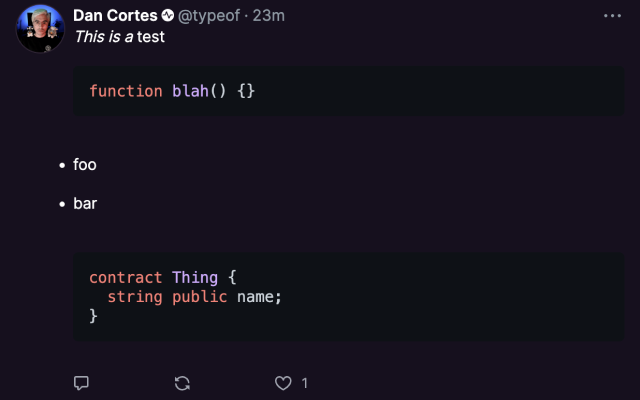

# FCMD

Markdown support and syntax highlighting on Warpcast.



## Temporary installation instructions

The extension is currently pending review on the Chrome Web Store. In the meantime, you can install it manually by following these steps:

1. Download the latest release from [here](https://github.com/dgca/fcmd/raw/main/download/chrome-mv3-prod.zip)
2. Unzip the file
3. Open the Chrome extensions page by typing `chrome://extensions` in the address bar
4. Enable developer mode by clicking the toggle switch next to "Developer mode" in the top right corner
5. Click the "Load unpacked" button in the top left corner
6. Select the unzipped folder

## Getting Started

This is a [Plasmo extension](https://docs.plasmo.com/) project bootstrapped with [`plasmo init`](https://www.npmjs.com/package/plasmo).

---

First, run the development server:

```bash
pnpm dev
# or
npm run dev
```

Open your browser and load the appropriate development build. For example, if you are developing for the chrome browser, using manifest v3, use: `build/chrome-mv3-dev`.

`content.ts` contains the bulk of the project.

For further guidance, [visit our Documentation](https://docs.plasmo.com/)

## Making production build

Run the following:

```bash
pnpm build
# or
npm run build
```

This should create a production bundle for your extension, ready to be zipped and published to the stores.

## Submit to the webstores

The easiest way to deploy your Plasmo extension is to use the built-in [bpp](https://bpp.browser.market) GitHub action. Prior to using this action however, make sure to build your extension and upload the first version to the store to establish the basic credentials. Then, simply follow [this setup instruction](https://docs.plasmo.com/framework/workflows/submit) and you should be on your way for automated submission!
